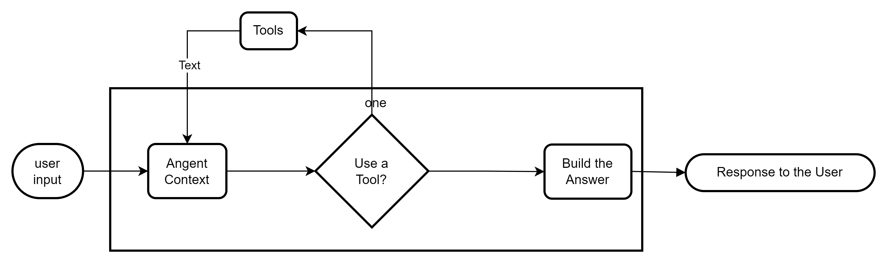
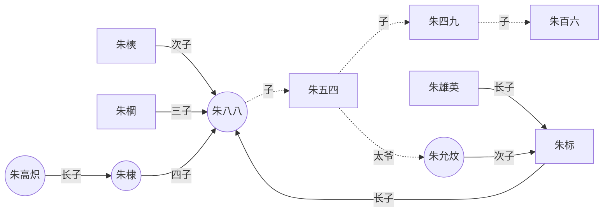

```mermaid
flowchart LR;
    A --> B
    subgraph one
    B --> C --yes--> D 
    end
    D--> E


    A([user \n input]) 
    B(Angent \n Context)
    C{Use a \n Tool?}
    D(Build the \n Answer) 
    E([Response to the User])
    F(Tools)

flowchart BT;
    C --yes-->B
    
```



