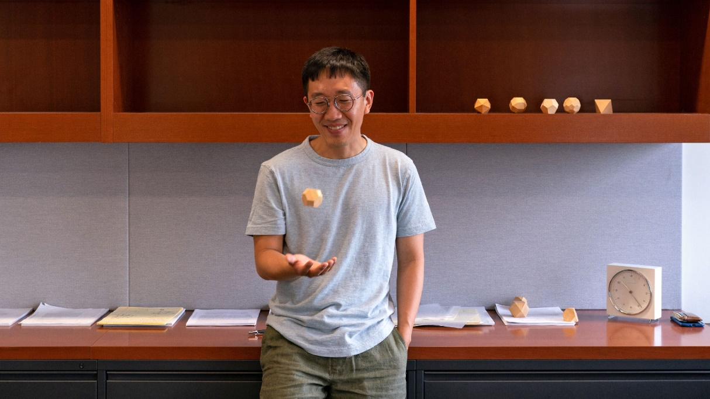
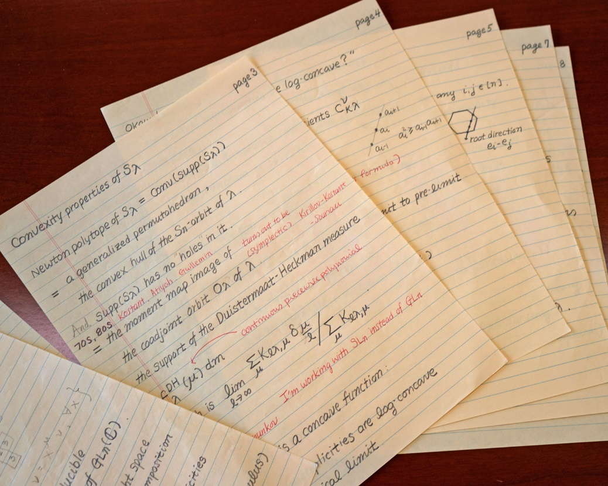
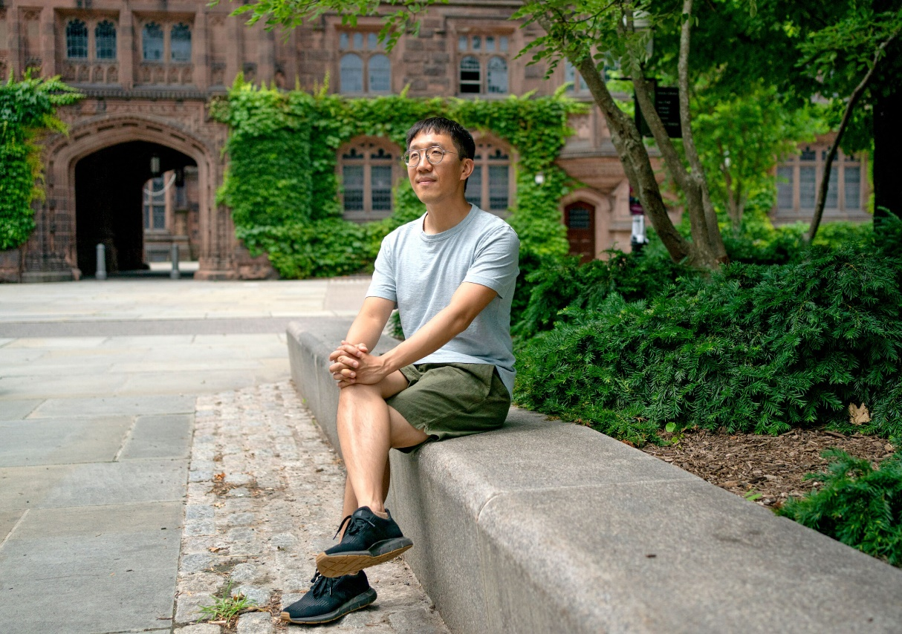
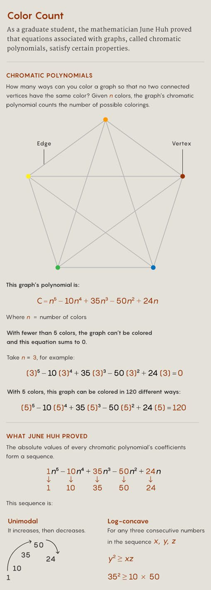
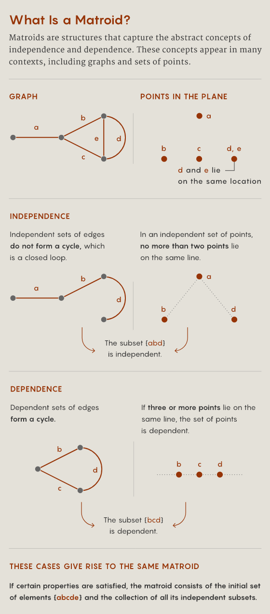
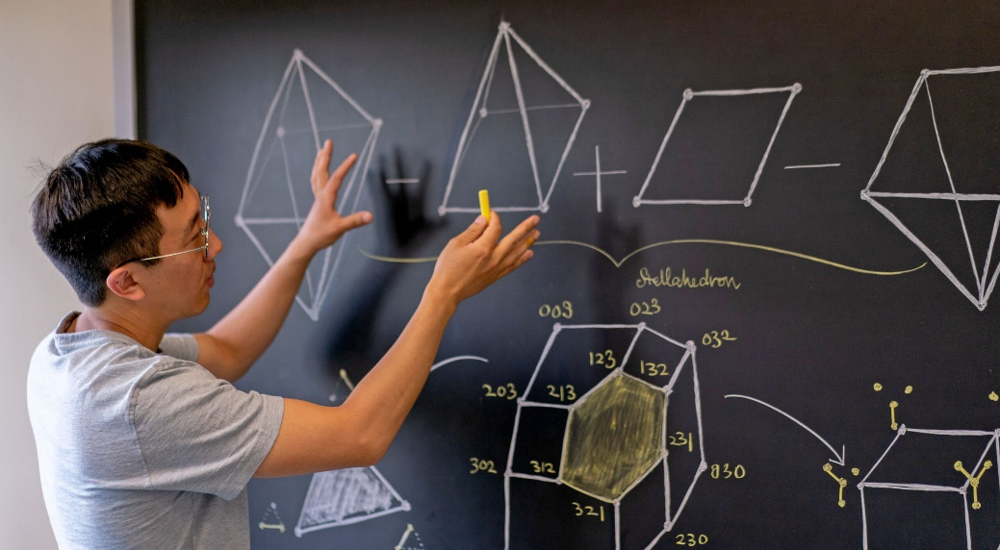
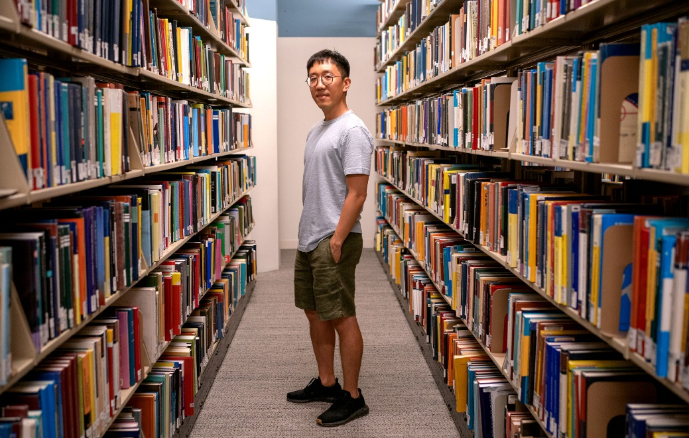
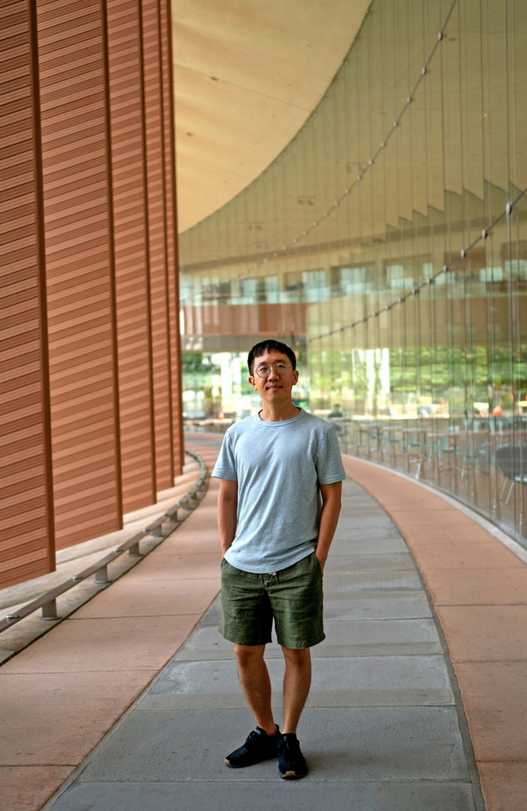
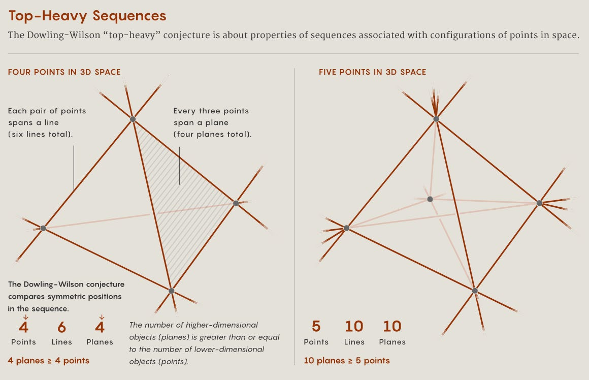
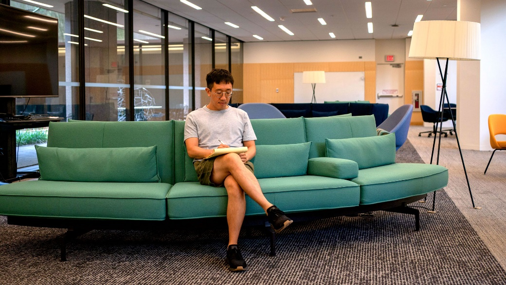

 
 
# 他曾决定辍学以成为诗人, 现在他获得了菲尔兹奖
 

> 作者：JORDANA CEPELEWICZ 
> 
> JUNE HUH 在大学六年级时偶然接触到了数学，从此开始对数学产生了浓厚的兴趣。他将组合数学和几何学深入地结合起来的深刻见解，使他获得了数学界的最高荣誉。 
 
June Huh 经常迷路。他是普林斯顿大学数学系的教授。在五月中旬的这个
特定的日子里，他正在环绕附近高级研究院的树林中漫步。“你要知道，”他
在考虑前方岔路时说，“我不知道我们在哪里。”他每隔一段时间就会停下来，
指出藏在树叶或树后的野生动物的微妙动作。在接下来的两个小时里，他看到
了一对青蛙、一只红冠鸟、一只指甲盖大小的海龟和一只敏捷的狐狸，每个动
物都得到了他安静的观察时间。 

他说：“我非常擅长发现东西。那是我的一个特殊能力。” 
 
39 岁的 Huh 因为能够漫步于数学领域并找到恰当的对象而获得了数学领域
的最高荣誉——菲尔兹奖。他用这些对象将几乎毫不相关的几何学和组合数学
领域联系起来，创造了全新且令人兴奋的研究方向。从研究生阶段开始，他已
经解决了组合数学中的几个重要问题，通过其他数学领域的绕路方式，找到了
每个证明的核心。每次，Huh 都感到这是一个“小奇迹”。 

或许同样可以说，他进入数学的道路也是充满了漫游和一系列小小的奇迹。
在年轻时，June Huh 没有想过成为数学家。他对这门学科漠不关心，甚至还辍
学去当了一名诗人。在大学时期，他的数学之路是经过了偶然的相遇和许多迷
失的时刻，才找到了一直在寻找的东西。 

那段诗意的回旋路线后来证明对他的数学突破至关重要。他的同事们认为，
他的艺术才华体现在他发现了那些在他工作中心的恰到好处的对象上，并在他
所做的一切中寻找更深层次的意义。 “数学家和艺术家很像，因为我们真的在
寻找美，” 圣弗朗西斯科州立大学数学家之一、June Huh 的合作者费德里科·阿
迪拉·曼蒂拉说，“但我认为在他的情况下，这真的很明显。我很喜欢他的品味。
他制造出美丽的事物。” 

“当我得知他从诗歌走进了数学，我就像‘好的，这对我来说有意义’” 
阿迪拉补充说。 

June Huh 本人也把艺术家和数学家之间画了一个类比。他说，对于两者来
说，“感觉就像你抓住了一些已经存在的东西，而不是在你的脑海中创造出了
东西。 

## 辍学者 

 
 
在任何一天，June Huh 都会有大约三个小时的专注工作时间。他可能会思
考一个数学问题，或为他的学生准备讲课，或为他的两个儿子安排看病的时间。
“然后我就筋疲力尽了，”他说。“做一些有价值、有意义、有创意的事情—
—或者一些他并不特别想做的任务，比如安排看病时间——需要消耗很多精
力。” 
 
按照他的说法，他通常没有太多控制权来决定在这三个小时内专注于什么。
在 2019 年春季的几个月里，他只做了一件事，就是阅读。他感觉有必要重读他
年轻时首次接触的书籍，包括罗马皇帝马可·奥勒留的《沉思录》和德国作家赫
尔曼·黑塞的几部小说。“这意味着我没有做任何工作，”June Huh 说。“所以
这是一个问题。”（不过他现在已经与这种限制和解了。“我曾试图抗拒……
但我最终学会了放弃这些诱惑。”因此，“我变得越来越擅长忽视截止日
期。”） 
 
他发现强迫自己做某事或设定一个具体目标——即使是他喜欢的事情——从
来不奏效。他特别难以把注意力从一件事情转移到另一件事情上。他说：“我
认为意图和意志力…被高估了。你很少用这些东西实现任何成就。” 

这种情况从他年轻时就一直存在。1983 年，他出生在加利福尼亚州，他的
父母当时正在完成研究生学业。大约两岁时，家人搬到了韩国首尔。在那里，
他的父亲教授统计学，母亲则教授俄语语言和文学。 

上学对他来说是非常痛苦的。他喜欢学习，但无法在课堂环境中集中精力
或吸收任何东西。相反，他喜欢自己阅读——在小学时，他阅读了一本关于生
物的 10 卷百科全书——并探索家附近的一座山。他很快熟悉了山的每一个角落，
但他仍然会迷路，有一次甚至走进了一个有可能存在地雷的禁区。 

他尽可能地避免学数学。他的父亲曾经试图用一本练习册来教他，但是
June Huh 只是从后面抄答案。当他的父亲发现并撕下这些页面时，June Huh 去
了一家当地的书店，在那里写下了答案。“他那时候放弃了，”June Huh 笑着
说。 

当他 16 岁的时候，正在韩国高中的第一年中（韩国高中为期三年），他决
定辍学写诗。他有点浪漫。“听好音乐后，我真的能够哭出来，”他说。他写
过关于自然和自己经历的诗歌。他计划在上大学之前的两年内完成自己的杰作。
“所以那没实现，”他笑了笑。 

他觉得写作过程太过专注于自我——对他来说，这种探索常常是痛苦和沮
丧的。此外，正如他后来意识到的，“我想成为一个写了伟大诗歌的人，”他
说。“我并不想写伟大的诗歌。”现在，他认为那个版本的自己几乎是一个完
全陌生的人了。 
 
2002 年，他进入首尔国立大学时，感到迷茫。他曾短暂地考虑过当科学作
家，决定主修天文学和物理学。但他经常逃课，并不得不重修几门课。“我只
是普遍迷失了，”他说。“我不知道自己想做什么。我不知道自己擅长什么。” 
结果发现，他其实擅长数学——这完全是偶然发现的。 
 
## 真正的美 

Huh 花了六年时间才毕业。在第六年，他选了一门由著名日本数学家广中
平佑（Heisuke Hironaka）教授的课程，广中平佑在 1970 年获得了菲尔兹奖。
广中平佑非常有魅力，Huh 很快被他吸引。 

但吸引 Huh 的不仅仅是他的教授的魅力，还有数学本身。这门课程本来是
一门代数几何的入门课，研究代数方程的解和它们的几何性质。但广中平佑讲
授的是他自己在奇异性理论领域的工作，重点研究某些类型的空间。Huh 说:“基本上，他讲的是他昨天想到的内容”，是非常特定的问题和并不一定正确的证明。这门课一开始有 200 名学生，但很快就只剩下了五个学生，其中包括Huh。 

这是他第一次亲眼见证研究性数学在现实中展开。广中平佑的讲座并不像
其他本科课程那样流畅，一切都已经精简，答案已经解决。Huh 喜欢这种悬念，
试图做一些没有人真正知道如何做的事情——以及不知道会发生什么事情的自
由和惊喜。他说，大学教授的典型材料是几个世纪来不断完善的，“这与观察
眼前的原始数学非常不同”。 

 

Huh 发现这种数学可以给他的东西，诗歌无法给他：寻找美丽的能力在自
己之外，尝试去抓住某些外在、客观和真实的东西，这种方式比写作更能打开 
他的心扉。“你不会想到自己的小我，”他说。“没有自我中心的地方。” 他
发现与当诗人时不同的是，他从不被获得认可的欲望所驱动。他只是想做数学。 
也许是因为认识到这一点，广中教授开始关注他。在毕业后，Huh 开始在
首尔国立大学攻读硕士学位，并与现在的妻子 Nayoung Kim 相遇后，他花了很
多时间与广中教授在一起。放学后，他跟随教授去日本，与他一起待在东京和
京都，背包，共进餐，当然还继续讨论数学。 
 
## 意外的发现 

Huh 在美国申请了大约十几个博士项目。但由于他在本科阶段成绩平庸，
除了一所外，其他学校都拒绝了他。2009 年，他开始在伊利诺伊大学香槟分校
攻读博士学位，后来于 2011 年转到密歇根大学完成博士学业。 
尽管面临种种挑战——生活在一个新的国家，与未婚妻 Nayoung Kim（她
留在首尔国立大学攻读数学博士学位）分开一段时间——Huh 非常珍视他在研
 
究生院的经历。他能够全身心地投入到数学中，并且他非常享受自由探索的自
由，这正是最初吸引他接触这门学科的原因。 
他立即脱颖而出。在伊利诺伊州成为初级研究生时，他证明了一项在图论
中存在 40 年的猜想。简单来说，这个问题被称为 Read 猜想，涉及到与图形相
关的多项式——例如
$n^4+5n^3+6n^2+3n+1$ ——这些方程式由由顶点（点）和边
（线）连接的集合组成。特别是，假设你想对图的顶点进行着色，以使得没有
两个相邻的顶点颜色相同。在你可以使用一定数量的颜色的情况下，有很多方
法可以对图进行着色。事实证明，可以使用称为色多项式（以使用的颜色数量
为单位书写）的方程式来计算所有可能的总数。 
数学家们观察到，无论图形如何，色多项式的系数总是遵循某些模式。首
先，它们是单峰的，即它们增加然后减少。以前面多项式为例，其系数的绝对
值——1、5、6、3、1——形成了一个单峰序列。此外，该序列还是“对数凹”
的。对于序列中的任意三个连续数，中间数的平方都至少不小于它两侧的数的
乘积。（例如，在上述多项式中，$62\leq 5 \times 3$ 。）
然而，数学家们一直在努力证明这些性质。突然间，似乎毫无征兆的，Huh 出现了。 

作为硕士生，他曾在日本跟随广中学习代数几何和奇点理论。该领域的主
要研究对象被称为代数簇，可以看作是由某些方程定义的形状。有趣的是，与
某些类型的代数簇相关联的数字已知是对数凹的——Huh 之所以知道这一点，
只是因为他的研究方向具有意外性。Huh 的关键想法是找到一种构造代数簇的
方法，使得那些相关数字恰好是最初问题中图的色数多项式的系数。 
 
 
 
他的解决方案震惊了数学界。因此，密歇根大学招募他入读他们的研究生
项目，而密歇根大学此前曾拒绝过他的申请。 

Huh 的成就之所以令人印象深刻，不仅仅是因为他解决了长期以来似乎无
法解决的 Read 猜想。他还表明，某些更深层次、更具有几何性质的事物隐藏在
图的组合性质下面。 

数学家们也对他的为人印象深刻。他在会议上的演讲总是易懂且具体，和
他交谈时，很明显他对自己正在研究的概念有深入而广泛的思考。"他对一个研
究生来说显得太成熟了，"乔治亚理工学院的数学家马修·贝克（Matthew Baker）
说。当贝克第一次见到他时，"我就在想，这个家伙是谁啊？" 

据密歇根大学的导师米尔切亚·穆斯塔塔（Mircea Mustaţă）表示，他几乎
不需要监督或指导。与大多数研究生不同的是，他已经有了自己的计划，并有
关于如何追求这个计划的想法。"他更像是一个同事，"穆斯塔塔说。"他已经有
了自己的看待事物的方式。" 

他的许多合作者都注意到他非常谦虚和接地气。当他得知自己获得了菲尔
兹奖时，"感觉并不是那么好，"Huh 说。"当然，你会感到高兴，但内心深处，
你有一点担心他们可能最终会发现你并不是那么优秀。我是一个相当优秀的数
学家，但我是否值得获得菲尔兹奖呢？" 

## 太空逃脱 

实际上，图只是可以定义更一般结构的一种对象，称为拟阵（Matroid）。
例如，考虑二维平面上的点。如果这个平面上的超过两个点落在同一条直线上，
那么可以说这些点是"相关的"。拟阵是抽象的对象，可以在各种不同的上下文
中捕捉类似于图形、向量空间和代数域中的相关性和独立性等概念。 
 
 

就像图形与其色多项式相关联一样，叫做特征多项式的方程也与拟阵
相关
联。有猜想认为，这些更一般的对象的多项式也应该具有凹对数系数。但是， 
Huh 用来证明 Read 猜想的技术仅适用于一类非常狭窄的拟阵，例如由图形产生
的拟阵。 
 
 
 
与数学家 Eric Katz 一起，Huh 扩大了这种证明适用于的拟阵类别。他们遵
循了一种配方。与以前一样，策略是从感兴趣的对象——这里是拟阵——开始，
利用它来构造一个代数簇。从那里，他们可以提取一个叫做上同调环的对象，
并使用一些其属性来证明对数凹性。 
 
只有一个问题。大多数拟阵都没有任何形式的几何基础，这意味着实际上
没有与它们相关联的代数簇。相反，Huh、Katz 和数学家 Karim Adiprasito 找到
了一种方法，可以直接从拟阵中编写出正确的上同调环，从零开始。然后，他
们使用一组新技术表明，它的行为就好像它来自实际的代数簇一样，尽管它并
没有。在这样做的过程中，他们证明了对所有拟阵的对数凹性，最终解决了所
谓的 Rota 猜想问题。Baker 说:“这很值得注意。” 
这项工作表明“你不需要空间来做几何学”，Huh 说。“这让我从根本上
重新思考了几何学是什么。”它还将指导他走向一系列其他问题，他在那里继
续推动这个想法，使他能够开发出更广泛的方法。 
但是，尽管工作需要具体化，但构建正确的上同调环需要大量的猜测和摸
索。这是 Huh 特别喜欢的工作方面。“没有指导原则……没有明确定义的目
标，”他说。“你只需要猜测。” 
 
与此相应的是，他在日常生活中的最佳状态也是缺乏意图。好像他发现了
一种完全适合他个性的数学程序。他再次发现，“事情就是自己发生的”。 
核心要点 

June Huh 说话缓慢，经常停顿，谨慎选择用词，举止平静，宛如冥想。与June Huh 合作过多项重要成果的威斯康星大学麦迪逊分校数学家 Botong Wang说：“他不容易激动。” 

June Huh 在做数学时也同样慎重从事。Botong Wang 第一次见到时感到震
惊。“我参加过数学竞赛，作为一名数学家，你必须聪明，必须快，”他说。
“但是 June Huh 恰恰相反……如果你与他谈论五分钟的微积分问题，你会认为
这个家伙甚至不能通过一个资格考试。他很慢。”事实上，Botong Wang 一开
始认为他们在浪费时间，处理已经了解的简单问题。但后来他意识到，June Huh 正在以更深入的方式学习即使看似简单的概念，并且以后会证明这正是有
用的方式。 

“June 喜欢用正确的方法做事，”西安大略省西部大学的数学家 Graham Denham 说，他也是 Huh 的合作者之一。 

例如，Denham、Ardila 和 Huh 刚刚完成了一个与 Rota 猜想密切相关的问
题的 50 页证明，当 Huh 说他们应该再花一些时间找到一个更干净、更有吸引
力的方法时，他们才刚刚完成了这个证明。他认为还有更好的解释，而且不要
急于求成。“Federico 和我当时就像，哦，好吧，那我们现在就放弃它？”
Denham 说。 

 
 
他们花了两年时间打磨更好的论点。“我们都是终身教授，这挺好的，”
Ardila 说。最终，Ardila 和 Denham 都认为这份额外的工作是值得的。他们的最
终结果“完全不同，更深入，而且[到达]事物的核心，”Ardila 说。

这种方法不仅适用于 Huh 的数学工作。2013 年，他决定学做饭。作为一个
完全的新手，他采取了每天做同样的菜——一道简单的油炒意面——直到做得完
美的策略。六个月来，他就是这样做的。（据 Kim 说，迄今为止，那是他唯一
会做的菜。） 

“June Huh 的整个生活都建立在日常的规律上。”他说，“我几乎每天都
做着完全相同的事情，我非常能够容忍重复。”他难以保持睡眠，通常会在凌
晨 3 点左右醒来。然后他去健身房，和妻子和两个儿子（一个 8 岁，另一个刚
过 1 岁）共进早餐，然后送大儿子去学校，再前往普林斯顿的办公室。

他的办公室很简朴，几乎空无一物。有一个大桌子，一张沙发可以睡觉—
—June Huh 通常在上午稍晚些时候会小睡一会儿——以及一张打开的瑜伽垫
（仅仅用来躺着，他说，他不知道如何做瑜伽）。没有书籍，只有几摞整齐排
列在一面书架上的文件。在角落里有一台吸尘器。June Huh 喜欢像清洁、洗碗
和把他所读的东西抄到笔记本上这样的重复、毫无头绪的活动。 

 
 
他经常在公共图书馆的儿童区工作，那里非常吵闹。“我不喜欢安静的地
方，”他说，“会让我昏昏欲睡。”在许多事情上，June Huh 都有这样的说法。

他每天午饭后会散步很久，然后返回办公室继续工作（除非他已经完成了
他的三小时配额），然后回家。他会和家人度过剩余的晚上时间；他们会一起
在一张大床上睡觉，大约在晚上 9 点左右入睡。

这种对例行公事的偏好——和对任何偏离例行公事的事情感到疲倦的倾向——有时会表现出极端的方式。例如，当他在密歇根州完成博士学位时，“我会几乎割掉所有其他的事情，” Huh 说。当他第一次搬到安娜堡时，他发现自
己没有为严寒的冬天做好准备。他几乎没有财物，但他需要一床毯子。但当他
查找如何到当地的购物中心时，他发现它的逻辑过于困难。“那已经超出了我
能承受的范围，”他说。“我不想浪费精力去想从这里到那里的路怎么走。”
相反，他走到附近的 CVS 药店，买了 10 块布和一个巨大的订书机，把布订在
一起做成毯子。
 
 
 
他曾经几个月只吃冷冻比萨饼，因为他不想处理买菜和做饭的事情。他只
想做数学。他形容那段时期的生活“近乎修道”。实际上，那时他一周只和指
导老师穆斯塔塔说一次话。 

Kim 回忆说，她曾经拜访过当时还在伊利诺伊州的 June Huh，之后，“我
真的重新思考了我们的关系”，她说，“我应该嫁给他吗？因为他（不能）应
对现实技能，生存技能。”

然而，2014 年他们还是结婚了。他们搬到了普林斯顿，在高等研究院都开
始工作了。这是 Kim 第一次在美国生活，她在某些用英语处理的事情上感到不
适，她得依靠 June Huh 来处理。他说，“让我们说，她很失望。”
那一年晚些时候，Kim 生下了他们的第一个儿子 Dan。在分娩时，她看到
June Huh 在做数学。 

“我妻子比我平衡得多，”他说，“生活有很多方面，数学只是其中非常
非常非常微小的一部分。” 

“我是个真正的工作者，”Kim 说，“他是个思想家。” 

但是，她补充说，June Huh 从那时起已经大大改善了。在他们养育 Dan 的
过程中，“我学会了过更平衡的生活，”June Huh 说，“那是一个转变时期。”
他花了很多时间和 Dan 在一起——和他一起画画、解决复杂数学作业，并带他
去书店和其他当地景点。他甚至会处理 Kim 要求他做的后勤任务，虽然心有不
甘。“我还是不喜欢，”他说，“但是，我们不能只靠订书机订毯子。”

现在，他甚至能够离开数学。他的头脑在闲暇时不再回到解决问题上，他
能够在需要时休息一下。

“他是一个完全不同的人了，”Kim 说。 

## 头重脚轻（Heavy on Top） 

不过，有些事情没有改变。Huh 仍然只能集中精力工作几个小时。Kim 说：
“别人工作一个小时就休息五分钟，他却是工作一个小时，然后做其他事情，
只集中注意力五分钟或十分钟。” 

他对美的追求也没有改变。经常他会回到对数凹性或类似概念的问题上，
以发掘那种美。 
 
例如，他、Wang 以及其他合作者最近证明了一个关于点、直线和平面配置
的基本问题，称为道林-威尔逊!“Top-Heavy”猜想。考虑平面上的有限点集，
其中每对点之间都连接有一条线。数学家保罗·埃尔德什和尼古拉斯·戈弗特·德
布鲁因曾经证明，线的数量必须大于或等于点的数量（除非所有点都在一条线
上）。例如，考虑四个位于正方形角上的点。线描绘出正方形，并连接相对的
两个角，总共有六条线。 

这个“Top-Heavy”猜想推广了这个想法。与其在平面上，你在某个高维空
间中给出了一组点。考虑连接点对的所有线，由三个点组成的平面，由四个点
构成的三维子空间，以此类推。现在考虑从这些数字构建的序列：点的数量、
线的数量、平面的数量。比较该序列中对称位置的数字（第一个和最后一个数
字、第二个和倒数第二个数字，以此类推）。相应于高维空间的数字将至少与
另一个数字相等，即该序列是“Top-Heavy”的（该序列据推测也是对数凹的，
但尚未证明；迄今为止，Huh 和 Wang 已经证明了序列的前半部分是单峰的）。

 
 
Huh 和 Wang 借鉴了 Huh 关于 Rota 猜想的工作思路，但在此过程中，他们
不得不进一步推进他的研究计划。他们再次使用了拟阵、代数簇和上同调环等
概念。但是这一次，他们必须寻找涉及奇点的代数簇，即在缩放时看起来与其
他点不同的空间位置。这使得构建正确的空间并证明其上同调环的某些性质变
得更加复杂——甚至更难解决那些需要直接从拟阵构造这些环的情况，而没有
代数簇来指导他们。 

在他们解决这个问题的五年时间里，Huh 还开始探索一种完全摆脱几何的
方法。他的工作大部分时间都涉及建立问题所需的确切上同调。此外，一旦找
到了这个上同调，数学家们仍然需要证明它满足某些性质，这可能需要数年的
时间。 
 
他开发的新理论（与数学家 Petter Brändén 一起）能够完全绕过这些方法。
它使他们能够解决称为“强 Mason 猜想”的问题（该问题涉及拟阵中独立集的
数量），其他数学家已经使用它以更简单的方式重新证明了 Rota 猜想。但更重
要的是，它打开了找到全新问题的大门，提示这些对数凹性陈述为什么正确的
深层次解释，并以令人着迷的方式与理论计算机科学中的问题相交，这些问题
现在才刚刚开始被探索。 
 
 
##  连接的咔嗒声 

对于 Huh 来说，当他在工作时，几乎有一种下意识的状态在进行。事实上，
他通常无法追溯他的想法是如何或何时出现的。他没有突然的灵感。相反，他
说：“在某个时刻，你只是意识到，哦，我知道了。”也许上周他还不理解某
件事，但现在，在没有任何额外输入的情况下，这些碎片已经无意识地拼接在
一起。他将其比作当你做梦时，你的思想可以让你感到意想不到的联系。“人
类思维能力真是令人惊叹，”他说。“承认我们不知道发生了什么事，这很
好。” 

也许这也表明了他内心中的艺术家。他希望继续揭示数学不同领域之间的
意想不到的联系。 

“他只是按照他最初的计划愿景，作为一个研究生就有了的计划视线在前
进，”Baker 说。“看看极限在哪里，将非常有趣。” 

到目前为止，Huh 还没有遇到极限。数学家们相信他将继续创造美丽的事
物。 

当被问及是否会回到自己先前的艺术家身份，重新尝试写诗时，他耸了耸
肩。“也许。但我不知道，”他说。“我对其他事情非常感兴趣。” 

[1]: 翻译自 Quantum Magazine. 愿标题 He Dropped Out to Become a Poet. Now He’s Won a Fields Medal. 
网址： https://www.quantamagazine.org/june-huh-high-school-dropout-wins-the-fields-medal-20220705/ 

