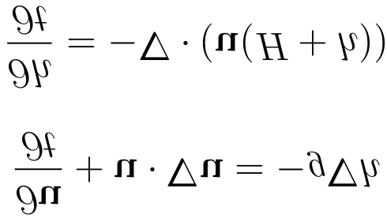

Part 1
Getting started with
Modern Fortran
In this part, you’ll get a taste of Fortran and a gentle introduction into the
language. 
 In chapter 1, we’ll discuss the design and features of Fortran, and the kinds
of problems for which Fortran is suitable. You’ll learn why parallel programming
is important and when you should use it. 
 In chapter 2, we’ll build a minimal working example of the tsunami simula-
tor that we’ll be working on throughout the book. This example will give you a
taste of the Fortran essentials: variable declaration, data types, arrays, loops, and
branches.
 If you’re new to Fortran, this is the place to start. At the end of this part of the
book, you’ll be able to write simple yet useful Fortran programs. More impor-
tantly, you’ll be ready to learn about Fortran essentials in more depth.
 
3
Introducing Fortran
This is a book about Fortran, one of the first high-level programming languages
in history. It will teach you the language by guiding you step-by-step through
the development of a fully featured, parallel physics simulation app. Notice the
emphasis on parallel. Parallel programming allows you to break your problem down
into pieces and let multiple processors each work on only part of the problem,
thus reaching the solution in less time. By the end, you’ll be able to recognize
problems that can be parallelized, and use modern Fortran techniques to solve
them.
 This book is not a comprehensive reference manual for every Fortran feature—
I’ve omitted significant parts of the language on purpose. Instead, I focus on the
most practical features that you’d use to build a real-world Fortran application. As
we work on our app chapter by chapter, we’ll apply modern Fortran features and
software design techniques to make our app robust, portable, and easy to use and
This chapter covers
 What is Fortran and why learn it?
 Fortran’s strengths and weaknesses
 Thinking in parallel
 Building a parallel simulation app from scratch
4
CHAPTER 1
Introducing Fortran
extend. This isn’t just a book about Fortran; it’s a book about building robust, parallel
software using modern Fortran.
1.1
What is Fortran?
I don’t know what the language of the year 2000 will look like, but I know it will be
called Fortran.
                          
—Tony Hoare, winner of the 1980 Turing Award
Fortran is a general-purpose, parallel programming language that excels in scientific
and engineering applications. Originally called FORTRAN (FORmula TRANslation)
in 1957, it has evolved over decades to become a robust, mature, and high perfomance-
oriented programming language. Today, Fortran keeps churning under the hood of
many systems that we take for granted:
 Numerical weather, ocean, and surf prediction
 Climate science and prediction
 Computational fluid dynamics software used in mechanical and civil engineering
 Aerodynamics solvers for designing cars, airplanes, and spacecraft
 Fast linear algebra libraries used by machine learning frameworks
 Benchmarking the fastest supercomputers in the world (https://top500.org)
Here’s a specific example. In my work, I develop numerical models of weather, ocean
surface waves, and deep ocean circulation. Talking about it over the years, I found
that most people didn’t know where weather forecasts came from. They had the idea
that meteorologists would get together and draw a chart of what the weather would be
like tomorrow, next week, or a month from now. This is only partly true. In reality, we
use sophisticated numerical models that crunch a huge amount of numbers on com-
puters the size of a warehouse. These models simulate the atmosphere to create an
educated guess about what the weather will be like in the future. Meteorologists use
the output of these models to create a meaningful weather map, like the one shown in
figure 1.1. This map shows just a sliver of all the data that this model produces. The
output size of a weather forecast like this is counted in hundreds of gigabytes.
 The most powerful Fortran applications run in parallel on hundreds or thousands of
CPUs. Development of the Fortran language and its libraries has been largely driven by
the need to solve extremely large computational problems in physics, engineering, and
biomedicine. To access even more computational power than what the most powerful
single computer at the time could offer, in the late 20th century we started connecting
many computers with high-bandwidth networks and let them each work on a piece of
the problem. The result is the supercomputer, a massive computer made up of thousands
of commodity CPUs (figure 1.2). Supercomputers are similar to modern server farms
hosted by Google or Amazon, except that the network infrastructure in supercomput-
ers is designed to maximize bandwidth and minimize latency between the servers
themselves, rather than between them and the outside world. As a result, the CPUs in
5
What is Fortran?
40
35
30
25
20
15
40
35
30
25
20
15
10
5
0
–100
–95
–90
–85
–80
Longitude
–75
–70
–65
–60
Latitude
Figure 1.1
A forecast of Hurricane Irma on September 10, 2017, computed by an 
operational weather prediction model written in Fortran. Shading and barbs show surface 
wind speed in meters per second, and contours are isolines of sea-level pressure. A 
typical weather forecast is computed in parallel using hundreds or thousands of CPUs. 
(Data provided by the NOAA National Center for Environmental Prediction [NCEP])
Figure 1.2
The MareNostrum 4 supercomputer at the Barcelona Supercomputing Center. 
The computer is housed inside the Torre Girona Chapel in Barcelona, Catalonia, Spain. A high-
speed network connects all of the cabinets to each another. With 153,216 Intel Xeon cores, 
MareNostrum 4 is the fastest supercomputer in Spain, and the 37th fastest in the world as of 
June 2020. (https://www.top500.org/lists/2020/06). It’s used for many scientific applications, 
from astrophysics and materials physics, to climate and atmospheric dust transport prediction, 
to biomedicine. (Image source: https://www.bsc.es/marenostrum/marenostrum)
6
CHAPTER 1
Introducing Fortran
a supercomputer act like one giant processor with distributed-memory access that’s
nearly as fast as local memory access. To this day, Fortran remains the dominant lan-
guage used for such massive-scale parallel computations. 
1.2
Fortran features
This is not your parents’ Fortran.
                                                      
—Damian Rouson
In the context of programming languages, Fortran is all of the following:
 Compiled—You’ll write whole programs and pass them to the compiler before exe-
cuting them. This is in contrast to interpreted programming languages like Python
or JavaScript, which are parsed and executed line by line. Although this makes
writing programs a bit more tedious, it allows the compiler to generate efficient
executable code. In typical use cases, it’s not uncommon for Fortran programs to
be one or two orders of magnitude faster than equivalent Python programs.
 Statically typed—In Fortran, you’ll declare all variables with a type, and they’ll
remain of that type until the end of the program:
real :: pi    
pi = 3.141592     
You’ll also need to explicitly declare the variables before their use, which is
known as manifest typing. Finally, Fortran employs so-called strong typing, which
means that the compiler will raise an error if a procedure is invoked with an
argument of the wrong type. While static typing helps the compiler to generate
efficient programs, manifest and strong typing enforce good programming
hygiene and make Fortran a safe language. I find it’s easier to write correct For-
tran programs than Python or Javascript, which come with many hidden caveats
and “gotchas.”
 Multiparadigm—You can write Fortran programs in several different paradigms,
or styles: imperative, procedural, object-oriented, and even functional. Some par-
adigms are more appropriate than others, depending on the problem you’re
trying to solve. We’ll explore different paradigms as we develop code through-
out the book.
What is a compiler?
A compiler is a computer program that reads source code written in one pro-
gramming language and translates it to equivalent code in another program-
ming language. In our case, a Fortran compiler will read Fortran source code
and generate appropriate assembly code and machine (binary) instructions.
pi must be declared 
before use.
pi remains a “real” number 
until the program halts.
7
Fortran features
 Parallel—Fortran is also a parallel language. Parallelism is the capability to split
the computational problem between processes that communicate through a
network. Parallel processes can be running on the same processing core (thread-
based parallelism), on different cores that share RAM (shared-memory paral-
lelism), or distributed across the network (distributed-memory parallelism).
Computers working together on the same parallel program can be physically
located in the same cabinet, across the room from each other, or across the
world. Fortran’s main parallel structure is a coarray, which allows you to express
parallel algorithms and remote data exchange without any external libraries.
Coarrays allow you to access remote memory just like you’d access elements of
an array, as shown in the following listing.
program hello_coarrays
implicit none
integer :: a[*]     
integer :: i
a = this_image()    
if (this_image() == 1) then      
do i = 1, num_images()          
print *, 'Value on image', i, 'is', a[i]   
end do
end if
end program hello_coarrays
The Fortran standard doesn’t dictate how the data exchange is implemented
under the hood; it merely specifies the syntax and the expected behavior. This
allows the compiler developers to use the best approach available on any spe-
cific hardware. Given a capable compiler and libraries, a Fortran programmer
can write code that runs on conventional CPUs or general-purpose GPUs alike.
Listing 1.1 is meant for illustration; however, if you’d like to compile and run it,
do so after following the instructions in Appendix A to set up your Fortran
development environment.
 Mature—In 2016, we celebrated 60 years since the birth of Fortran. The lan-
guage has evolved through several revisions of the standard:
– FORTRAN 66, also known as FORTRAN IV (ANSI, 1966)
– FORTRAN 77 (ANSI, 1978)
– Fortran 90 (ISO/IEC, 1991; ANSI, 1992)
– Fortran 95 (ISO/IEC, 1997)
Listing 1.1
Example data exchange between parallel images
Each image declares a local 
copy of an integer “a.”
Each image assigns its 
number (1, 2, 3, etc.) to “a.”
Only image 1 will 
enter this if block.
Iterates from 1 to the 
total number of images
For each remote image, 
image 1 will get the value 
of “a” on that image and 
print it to the screen.
8
CHAPTER 1
Introducing Fortran
– Fortran 2003 (ISO/IEC, 2004)
– Fortran 2008 (ISO/IEC, 2010)
– Fortran 2018 (ISO/IEC, 2018)
Fortran development and implementation in compilers have been heavily sup-
ported by the industry: IBM, Cray, Intel, NAG, NVIDIA, and others. There has
also been significant open source development, most notably free compilers—
gfortran (https://gcc.gnu.org/wiki/GFortran), Flang (https://github.com/flang-
compiler/flang), and LFortran (https://lfortran.org)—as well as other com-
munity projects (https://fortran-lang.org/community). Thanks to Fortran’s
dominance in the early days of computer science, today we have a vast set of
robust and mature libraries that are the computational backbone of many appli-
cations. With mature compilers and a large legacy code base, Fortran remains
the language of choice for many new software projects for which computational
efficiency and parallel execution are key.
 Easy to learn—Believe it or not, Fortran is quite easy to learn. This was my expe-
rience and that of many of my colleagues. It’s easy to learn partly due to its strict
type system, which allows the compiler to keep the programmer in check and
warn them at compile time when they make a mistake. Although verbose, the
syntax is clean and easy to read. However, like every other programming lan-
guage or skill in general, Fortran is difficult to master. This is one of the reasons
why I chose to write this book. 
1.3
Why learn Fortran?
There were programs here that had been written five thousand years ago, before
Humankind ever left Earth. The wonder of it—the horror of it, Sura said—was that
unlike the useless wrecks of Canberra’s past, these programs still worked! And via a
million million circuitous threads of inheritance, many of the oldest programs still ran in
the bowels of the Qeng Ho system.
                                                      
—Vernor Vinge, A Deepness in the Sky
Since the early 1990s, we’ve seen an explosion of new programming languages and
frameworks, mainly driven by the widespread use of the internet and, later, mobile
devices. C++ took over computer science departments, Java has been revered in the
enterprise, JavaScript redefined the modern web, R became the mother tongue of
statisticians, and Python took the machine learning world by storm. Where does For-
tran fit in all this? Through steady revisions of the language, Fortran has maintained a
solid footing in its niche domain, high-performance computing (HPC). Its computa-
tional efficiency is still unparalleled, with only C and C++ coming close. Unlike C and
C++, Fortran has been designed for array-oriented calculations, and is, in my opinion,
significantly easier to learn and program. A more recent strong argument for Fortran
has come about through its native support for parallel programming.
 
9
Why learn Fortran?
Despite being a decades-old technology, Fortran has several attractive features that
make it indispensable, even compared to more recent languages:
 Array-oriented—Fortran provides whole-array arithmetic and operations, which
greatly simplify element-wise operations. Consider the task of multiplying two
two-dimensional arrays:
do j = 1, jm
do i = 1, im
c(i,j) = a(i,j) * b(i,j)
end do
end do
With Fortran’s whole-array arithmetic, you write
c = a * b
This is not only more expressive and readable code, it also hints to the compiler
that it can choose the optimal way to perform the operation. Arrays lend them-
selves well to CPU architectures and computer memory because they’re contig-
uous sequences of numbers, and thus mirror the physical layout of the memory.
Fortran compilers are capable of generating extremely efficient machine code,
thanks to the assumptions that they can safely make.
 The only parallel language developed by a standards committee (ISO)—The Fortran
standards committee ensures that the development of Fortran goes in the direc-
tion that supports its target audience: computational scientists and engineers.
 Mature libraries for science, engineering, and math—Fortran started in the 1950s as
the programming language for science, engineering, and mathematics. Decades
later, we have a rich legacy of robust and trusted libraries for linear algebra,
numerical differentiation and integration, and other mathematical problems.
These libraries have been used and tested by generations of programmers, to
the point that they are guaranteed to be almost bug-free.
 Growing general-purpose library ecosystem—In the past decade, Fortran has also
seen a growing ecosystem of general-purpose libraries: text parsing and manip-
ulation, I/O libraries for many data formats, working with dates and times, col-
lections and data structures, and so on. Any programming language is as
What is high-performance computing?
High-performance computing (HPC) is the practice of combining computer resources
to solve computational problems that would otherwise not be possible with a single
desktop computer. HPC systems typically aggregate hundreds or thousands of serv-
ers and connect them with fast networks. Most HPC systems today run some flavor
of Linux OS.
10
CHAPTER 1
Introducing Fortran
powerful as its libraries, and the growing number of Fortran libraries make it
more useful today than ever before.
 Unmatched performance—Compiled Fortran programs are as close to the metal as
it gets with high-level programming languages. This is thanks to both its array-
oriented design and mature compilers that continuously improve at optimizing
code. If you’re working on a problem that does math on large arrays, few other
languages come close to Fortran’s performance.
In summary, learn Fortran if you need to implement efficient and parallel numerical
operations on large multidimensional arrays. 
1.4
Advantages and disadvantages
Many Fortran features give it both an advantage and a disadvantage. For example, it’s
all of the following:
 A domain-specific language—Despite being technically a general-purpose language,
Fortran is very much a domain-specific language, in the sense that it has been
designed for science, engineering, and math applications. If your problem
involves some arithmetic on large and structured arrays, Fortran will shine. If
you want to write a web browser or low-level device drivers, Fortran is not the
right tool for the task.
 A niche language—Fortran is extremely important to a relatively small number of
people: scientists and engineers in select disciplines. As a consequence, it may
be difficult to find as many tutorials or blogs about Fortran as there are for
more mainstream languages.
 A statically and strongly typed language—As I mentioned earlier, this makes For-
tran a very safe language to program in and helps compilers generate efficient
executables. On the flip side, it makes it less flexible and more verbose, and
thus not the ideal language for rapid prototyping.
The comparison of Fortran to Python that follows will help you better understand its
advantages and disadvantages in the general-purpose programming context.
1.4.1
Side-by-side comparison with Python
How does modern Fortran compare to a more recent general-purpose programming
language? Python has had the most rapidly growing ecosystem in the past few years for
data analysis and light number crunching (http://mng.bz/XP71). It’s used by many
Fortran programmers for postprocessing of model output and data analysis. In fact,
Python is my second favorite programming language. Because of the application
domain overlap between Fortran and Python, it’s useful to summarize key differences
between the two, as shown in table 1.1. If you’re a Python programmer, this summary
will give you an idea of what you can and can’t do with Fortran.
11
Advantages and disadvantages
From table 1.1, a few key differences between Fortran and Python stand out. First, For-
tran is compiled and statically typed, while Python is interpreted and dynamically
typed. This makes Fortran more verbose and slower to program but allows the com-
piler to generate fast binary code. This is a blessing and a curse: Fortran isn’t designed
for rapid prototyping, but can produce robust and efficient programs. Second, For-
tran is a natively parallel programming language, with syntax that allows you to write
parallel code that’s independent of whether it will run on shared or distributed mem-
ory computers. In contrast, distributed parallel programming in Python is possible
only with external libraries, and is overall more difficult to do. Finally, Fortran is a
smaller language that focuses on efficient computation over large multidimensional
Table 1.1
Comparison between Fortran and Python (CPython specifically)
Language
Fortran
Python
First appeared
1957
1991
Latest release
Fortran 2018
3.8.5 (2020)
International standard
ISO/IEC
No
Implementation language
C, Fortran, Assembly 
(compiler-dependent)
C
Compiled vs. interpreted
Compiled
Interpreted
Typing discipline
Static, strong
Dynamic, strong
Parallel
Shared and distributed 
memory
Shared memory only
Multidimensional arrays
Yes, up to 15 dimensions
Third-party library only (numpy)
Built-in types
character, complex, 
integer, logical, real
bool, bytearray, bytes, complex, 
dict, ellipsis, float, frozenset, 
int, list, set, str, tuple
Constants
Yes
No
Classes
Yes
Yes
Generic programming
Limited
Yes
Pure functions
Yes
No
Higher order functions
Limited
Yes
Anonymous functions
No
Yes
Interoperability with other 
languages
C (limited)
C
OS interface
Limited
Yes
Exception handling
Limited
Yes
12
CHAPTER 1
Introducing Fortran
arrays of a few different numeric data types. On the other side, Python has a much
broader arsenal of data structures, algorithms, and general-purpose utilities built in.
 In summary, whereas Python is akin to a comprehensive and flexible toolbox, For-
tran is like a highly specialized power tool. Fortran thus isn’t well suited for writing
device drivers, video games, or web browsers. However, if you need to solve a large
numerical problem that can be distributed across multiple computers, Fortran is the
ideal language for you. 
1.5
Parallel Fortran, illustrated
I’ll illustrate the kind of problem where Fortran really shines. Let’s call this example
“Summer ends on old Ralph’s farm.”
 Farmer Ralph has two sons and two daughters, and a big farm. It’s the end of the
summer and about time to cut the grass and make hay for the cattle to eat. But the pas-
ture is big, and old Ralph is weak. His children, however, are young and strong. If they
all work hard and as a team, they could get it done in a day. They agree to split the
work between themselves in four equal parts. Each of Ralph’s children grabs a scythe
and a fork and heads to their part of the pasture. They work hard, cutting grass row by
row. Every hour or so, they meet at the edges to sharpen their tools and chat about how
it’s going. The work is going well, and almost all of the grass is cut by mid-afternoon.
Near the end of the day, they collect the hay into bales and take them to the barn. Old
Ralph is happy that he has strong and hard-working children, but even more so that
they make such a great team! Working together, they completed work that would take
four times as long if only one of them was working.
 Now you must be thinking, what the heck does old Ralph’s farm have to do with
parallel Fortran programming? More than meets the eye, I can tell you! Old Ralph
and his big pasture are an analogy to a slow computer and a big compute problem.
Just like Ralph asked his children to help him with the chores, in a typical parallel
problem we’ll divide the computational domain, or input data, into equal pieces and
distribute them between CPUs. Recall that his children cut the grass row by row—
some of the most efficient and expressive aspects of Fortran code are the whole-array
operations and arithmetic. Periodically, they met at the edges to sharpen their tools
and have a chat. In many real-world apps, you’ll instruct the parallel processes to
exchange data, and this is true for most of the parallel examples that I’ll guide you
through in this book. Finally, each parallel process asynchronously writes its data to
disk, like taking the hay bales to the barn. I illustrate this pattern in figure 1.3.
 Much like farmer Ralph, Fortran is old. This is by no means a bad thing! It’s a
mature, robust, and dependable language that isn’t going anywhere. Although it does
have some quirks of an old programming language, it’s been improved over decades
by generations of computer scientists and programmers, and has been battle-tested in
countless applications where performance is critical. The ease of parallel program-
ming with Fortran is key for high-performance apps, which is why I made it a central
theme of this book.
13
What will you learn in this book?
1.6
What will you learn in this book?
This book will teach you how to write modern, efficient, and parallel Fortran pro-
grams. Working through each chapter, we’ll build from scratch a fully functional, par-
allel, fluid dynamics solver with a specific application to tsunami prediction. If you
work through the book, you’ll come out with three distinct skill sets:
 You’ll be fluent with most modern Fortran features. This is a unique and
desired skill in a robust, multibillion-dollar market that is HPC.
 You’ll be able to recognize problems that are parallel in nature. You’ll think
parallel-first, and parallel solutions to problems will seem intuitive. In contrast,
a serial solution to a parallel problem will become an edge-case scenario.
 You’ll get a grasp on good software design, writing reusable code, and sharing
your project with the online community. You’ll also be able to adapt existing
Fortran libraries in your project and contribute back. This will not only make
your project useful to others, but can open doors in terms of career and learn-
ing opportunities. It did for me!
CPU 1
CPU 2
CPU 4
CPU 3
?
CPU 1
CPU 2
CPU 4
CPU 3
CPU 1
CPU 2
CPU 4
CPU 3
1. Big compute problem
4. Store the data to disk.
2. Divide the work
into smaller pieces.
3. Exchange data between
CPUs when needed.
Figure 1.3
Parallel programming patterns: divide the problem, exchange data, 
compute, and store the results to disk
14
CHAPTER 1
Introducing Fortran
While I’m not expecting you to have prior Fortran experience, I assume you have at
least some programming experience in a language like Python, R, MATLAB, or C. We
won’t go into detail about what is a program, a variable, a data type, source code, or
computer memory, and I’ll assume that you have an idea about these concepts. Occa-
sionally, we’ll touch on elements of calculus, although it’s not crucial that you’re
familiar with it. We’ll also work quite a bit in the terminal (compiling and running
programs), so I assume you’re at least comfortable navigating the command line.
Whatever the case, to help ensure clarity, any Fortran concept in this book will be
taught from scratch.
 Given the theme of the book, I expect it will be ideal for several audiences, such as
the following:
 Undergraduate and graduate students in physical science, engineering, or applied
math, especially with a focus on fluid dynamics
 Instructors and researchers in the above fields
 Meteorologists, oceanographers, and other fluid dynamicists working in the
industry
 Serial Fortran programmers who want to step up their parallel game
 HPC system administrators
If you fit in one of the above categories, you may already know that Fortran’s main sell-
ing point is its ease of programming efficient and parallel programs for large super-
computers. This has kept it as the dominant HPC language of physical sciences and
engineering. Although this book will teach you Fortran from the ground up, I will also
take the unconventional approach and teach it in the context of parallel program-
ming from the get-go. Rather than gaining just another technical skill as an after-
thought, you’ll learn how to think parallel. You’ll recognize ways you can distribute the
workload and memory to arrive at the solution more efficiently. With parallel think-
ing, you’ll come out with two critical advantages:
1
You’ll be able to solve problems in less time.
2
You’ll be able to solve problems that can’t fit onto a single computer.
While the first is at least a nice-to-have, the second is essential. Some problems simply
can’t be solved without parallel programming. The next section will give you a gentle
introduction and an example of parallel programming.
1.7
Think parallel!
For over a decade prophets have voiced the contention that the organization of a single
computer has reached its limits and that truly significant advances can be made only by
interconnection of a multiplicity of computers in such a manner as to permit cooperative
solution.
                  
—Gene Amdahl (computer architect) in 1967
Parallel programming is only becoming more important with time. Although still
positive, the rate of semiconductor density increase, as described by Moore’s law, is
15
Think parallel!
limited. Traditionally we went past this limit by placing more processing cores on a
single die. Even the processors in most smartphones today are multicore. Beyond the
shared-memory computer, we’ve connected many machines into networks, and made
them talk to each other to solve huge computational problems. Your weather forecast
this morning was computed on hundreds or thousands of parallel processors. Due to
the practical limits of Moore’s law and the current tendency toward many-core archi-
tectures, there’s a sense of urgency to teach programming parallel-first.
All parallel problems fall into two categories:
1
Embarrassingly parallel—And by this, I mean “embarrassingly easy”—it’s a good
thing! These problems can be distributed across processors with little to no
effort (figure 1.4, left). Any function f(x) that operates element-wise on an
array x without need for communication between elements is embarrassingly
parallel. Because the domain decomposition of embarrassingly parallel prob-
lems is trivial, modern compilers can often autoparallelize such code. Examples
include rendering graphics, serving static websites, or processing a large num-
ber of independent data records.
2
Nonembarrassingly parallel—Any parallel problem with interdependency between
processes requires communication and synchronization (figure 1.4, right). Most
partial differential equation solvers are nonembarrassingly parallel. The relative
amount of communication versus computation dictates how well a parallel
problem can scale. The objective for most physical solvers is thus to minimize
communication and maximize computation. Examples are weather prediction,
molecular dynamics, and any other physical process that’s described by partial
differential equations. This class of parallel problems is more difficult and, in
my opinion, more interesting!
What is Moore’s law?
Gordon Moore, cofounder of Intel, noticed in 1965 that the number of transistors
in a CPU was doubling each year. He later revised this trend to doubling every two
years. Nevertheless, the rate of increase is exponential and closely related to a
continuous decrease in the cost of computers. A computer you buy today for
$1,000 is about twice as powerful as one you could buy for the same amount two
years ago.
Similarly, when you buy a new smartphone, the OS and the apps run smoothly and
quickly. What happens two years later? As the apps update and bloat with new fea-
tures, they demand increasingly more CPU power and memory. As the hardware in
your phone stays the same, eventually the apps slow down to a crawl.
16
CHAPTER 1
Introducing Fortran
Because our application domain deals mainly with nonembarrassingly parallel prob-
lems, we’ll focus on implementing parallel data communication in a clean, expressive,
and minimal way. This will involve both distributing the input data among processors
(downward dashed arrows in figure 1.4) and communicating data between them (hor-
izontal dashed arrow in figure 1.4).
 Parallel Fortran programming in the past has been done either using the OpenMP
directives for shared-memory computers only, or with the Message Passing Interface (MPI)
for both shared and distributed memory computers. Differences between shared-
memory (SM) and distributed-memory (DM) systems are illustrated in figure 1.5. The
main advantage of SM systems is very low latency in communication between pro-
cesses. However, there’s a limit to the number of processing cores you can have in an
SM system. Since OpenMP was designed for SM parallel programming exclusively,
we’ll focus on MPI for our specific example.
Why is it called embarrassingly parallel?
It refers to overabundance, as in an embarrassment of riches. It’s the kind of problem
that you want to have. The term is attributed to Cleve Moler, inventor of MATLAB and
one of the authors of EISPACK and LINPACK, Fortran libraries for numerical comput-
ing. LINPACK is still used to benchmark the fastest supercomputers in the world.
Output
y
y
= ( 1, y2)
Embarassingly parallel
Input
CPU 1
Output
x1
y1
Nonembarassingly parallel
CPU 2
x2
y2
Input
CPU 1
CPU 2
x
x
= ( 1, x2)
Figure 1.4
An embarrassingly parallel problem (left) versus a 
nonembarrassingly parallel problem (right). In both cases, the CPUs 
receive input (x1, x2) and process it to produce output (y1, y2). 
In an embarrassingly parallel problem, x1 and x2 can be processed 
independently of each other. Furthermore, both input and output 
data are local in memory to each CPU, indicated by solid arrows. In 
a nonembarrassingly parallel problem, input data is not always local 
in memory to each CPU and has to be distributed through the 
network, indicated by dashed arrows. In addition, there may be data 
interdependency between CPUs during the computation step, which 
requires synchronization (horizontal dashed arrow).
17
Think parallel!
1.7.1
Copying an array from one processor to another
In most scientific and engineering parallel applications, there’s data dependency
between processes. Typically, a two-dimensional array is decomposed into tiles like a
chessboard, and the workload of each tile is assigned to a processor. Each tile has its
own data in memory that’s local to its processor. To illustrate the simplest case of par-
allel programming in a real-world scenario, let’s take the following meteorological sit-
uation for example. Suppose that the data consists of two variables: wind and air
OpenMP versus MPI
OpenMP is a set of directives that allows the programmer to indicate to the compiler
the sections of code that are to be parallelized. OpenMP is implemented by most For-
tran compilers and doesn’t require external libraries. However, OpenMP is limited to
shared-memory machines.
Message Passing Interface (MPI) is a standardized specification for portable mes-
sage passing (copying data) between arbitrary remote processes. This means that
MPI can be used for multithreading on a single core, multicore processing on a
shared-memory machine, or distributed-memory programming across networks. MPI
implementations typically provide interfaces for C, C++, and Fortran. MPI is often
described as the assembly language of parallel programming, illustrating the fact that
most MPI operations are low-level.
Although still ubiquitous in HPC, OpenMP and MPI are specific approaches to parallel
computing that can be more elegantly expressed with coarrays. This book will focus
on coarrays exclusively for parallel programming.
Shared memory
Distributed memory
Network
CPU 1
CPU 1
CPU 2
CPU 3
CPU 4
CPU 2
CPU 3
CPU 4
RAM
Figure 1.5
A shared-memory system (left) versus a distributed-
memory system (right). In a shared-memory system, processors have 
access to common memory (RAM). In a distributed-memory system, 
each processor has its own memory, and they exchange data through 
a network, indicated by dashed lines. The distributed-memory system is 
most commonly composed of multicore shared-memory systems.
18
CHAPTER 1
Introducing Fortran
temperature. Wind is blowing from one tile with a lower temperature (cold tile) toward
another tile with a higher temperature (warm tile). If we were to solve how the tempera-
ture evolves over time, the warm tile would need to know what temperature is coming in
with the wind from the cold tile. Because this is not known a priori (remember that the
data is local to each tile), we need to copy the data from the cold tile into the memory
that belongs to the warm tile. On the lowest level, this is done by explicitly copying the
data from one processor to another. When the copy is finished, the processors can con-
tinue with the remaining computations. Copying one or more values from one process
to another is the most common operation done in parallel programming (figure 1.6).
Let’s focus on just this one operation. Our goal is to do the following:
1
Initialize array on each process—[1, 2, 3, 4, 5] on CPU 1 and all zeros on
CPU 2.
2
Copy values of array from CPU 1 to CPU 2.
3
Print the new values of array on CPU 2. These should be [1, 2, 3, 4, 5].
I’ll show you two example solutions to this problem. One is the traditional approach
using an external library like MPI. Unless you’re a somewhat experienced Fortran
programmer, don’t try to understand every detail in this example. I merely want to
demonstrate how complicated and verbose it is. Then, I’ll show you the solution using
coarrays. In contrast to MPI, coarrays use an array indexing-like syntax to copy remote
data between parallel processes.
MPI: THE TRADITIONAL WAY TO DO PARALLEL PROGRAMMING
As noted before, MPI is often described as the assembly language of parallel program-
ming, and, indeed, that was its developers’ original intention. MPI was meant to be
implemented by compiler developers to enable natively parallel programming lan-
guages. Over the past three decades, however, application developers have been faster
at adopting MPI directly in their programs, and it has become, for better or worse, a
de facto standard tool for parallel programming in Fortran, C, and C++. As a result,
most HPC applications today rely on low-level MPI calls.
Array
CPU 2
0
0
0
0
0
Array
CPU 1
3
2
1
4
5
Figure 1.6
An illustration of a remote array copy between two CPUs. 
Numbers inside the boxes indicate initial array values. Our goal is to copy 
values of array from CPU 1 to CPU 2.
19
Think parallel!
 The following Fortran program sends data from one process to another using MPI.
program array_copy_mpi
use mpi         
implicit none
integer :: ierr, nproc, procsize, request
integer :: stat(mpi_status_size)
integer :: array(5) = 0
integer, parameter :: sender = 0, receiver = 1
call mpi_init(ierr)      
call mpi_comm_rank(mpi_comm_world, nproc, ierr)      
call mpi_comm_size(mpi_comm_world, procsize, ierr)   
if (procsize /= 2) then
      
call mpi_finalize(ierr)
      
stop 'Error: This program must be run &      
on 2 parallel processes'
      
end if
      
if (nproc == sender) array = [1, 2, 3, 4, 5]    
print '(a,i1,a,5(4x,i2))', 'array on proc ', nproc, &  
' before copy:', array
  
call mpi_barrier(mpi_comm_world, ierr)  
if (nproc == sender) then
call mpi_isend(array, size(array), mpi_int, &   
receiver, 1, mpi_comm_world, request, ierr)   
else if (nproc == receiver) then
call mpi_irecv(array, size(array), mpi_int, &    
sender, 1, mpi_comm_world, request, ierr)
    
call mpi_wait(request, stat, ierr)    
end if
print '(a,i1,a,5(4x,i2))', 'array on proc ', nproc, &
' after copy: ', array
call mpi_finalize(ierr)    
end program array_copy_mpi
Running this program on two processors outputs the following:
array on proc 0 before copy:
1
2
3
4
5
array on proc 1 before copy:
0
0
0
0
0
array on proc 0 after copy:
1
2
3
4
5
array on proc 1 after copy:
1
2
3
4
5
Listing 1.2
Copying an array from one process to another using MPI
Accesses MPI subroutines and 
the mpi_comm_world global 
variable from a module
Initializes
MPI
Which processor 
number am I?
How many processes 
are there?
Shuts down MPI and 
stops the program if 
we’re not running 
on two processors
Initializes
array on
sending
process
Prints text to screen 
with specific formatting
Waits here
for both
processes
Sender posts a 
nonblocking send
Receiver posts a 
nonblocking receive
Receiver
waits for
the
message
Finalizes MPI at the 
end of the program
20
CHAPTER 1
Introducing Fortran
This confirms that our program did what we wanted: copied the array from process 0
to process 1.
ENTER FORTRAN COARRAYS
Coarrays are the main data structure for native parallel programming in Fortran.
Originally developed by Robert Numrich and John Reid in the 1990s as an exten-
sion for the Cray Fortran compiler, coarrays have been introduced into the standard
starting with the 2008 release. Coarrays are much like arrays, as the name implies,
except that their elements are distributed along the axis of parallel processes
(cores or threads). As such, they provide an intuitive way to copy data between
remote processes.
 The following listing shows the coarray version of our array copy example.
program array_copy_caf
implicit none
integer :: array(5)[*] = 0       
integer, parameter :: sender = 1, receiver = 2
if (num_images() /= 2) &                          
stop 'Error: This program must be run on 2 parallel processes'
if (this_image() == sender) array = [1, 2, 3, 4, 5]      
print '(a,i2,a,5(4x,i2))', 'array on proc ', this_image(), &
' before copy:', array
sync all            
if (this_image() == receiver) &    
array(:) = array(:)[sender]
    
print '(a,i1,a,5(4x,i2))', 'array on proc ', this_image(), &
' after copy: ', array
end program array_copy_caf
Compiling and running the examples
Don’t worry about building and running these examples yourself for now. At the start
of the next chapter, I’ll ask you to set up the complete compute environment for work-
ing with examples in this book, including this example. If you prefer, you can follow
the instructions in appendix A now instead of waiting. 
Listing 1.3
Copying an array from one process to another using coarrays
Declares and initializes 
an integer coarray
Throws an error if 
we’re not running 
on two processes
Initializes 
array in 
sender
Waits here for all images; 
equivalent to mpi_barrier()
Nonblocking copy from sending 
image to receiving image
21
Think parallel!
The output of the program is the same as in the MPI variant:
array on proc 1 before copy:
1
2
3
4
5
array on proc 2 before copy:
0
0
0
0
0
array on proc 1 after copy:
1
2
3
4
5
array on proc 2 after copy:
1
2
3
4
5
These two programs are thus semantically the same. Let’s look at the key differences
in the code:
 The number of lines of code (LOC) dropped from 27 in the MPI example to 14
in the coarray example. That’s almost a factor of 2 decrease. However, if we look
specifically for MPI-related boilerplate code, we can count 15 lines of such code.
Compare this to two lines of code related to coarrays! As debugging time is
roughly proportional to the LOC, we see how coarrays can be more cost-effective
for developing parallel Fortran apps.
 The core of the data copy in the MPI example is quite verbose for such a simple
operation
if (nproc == 0) then
call mpi_isend(array, size(array), mpi_int, receiver, 1, &
mpi_comm_world, request, ierr)
else if (nproc == 1) then
call mpi_irecv(array, size(array), mpi_int, sender, 1, &
mpi_comm_world, request, ierr)
call mpi_wait(request, stat, ierr)
end if
compared to the intuitive array-indexing and assignment syntax of coarrays:
if (this_image() == receiver) array(:) = array(:)[sender]
 Finally, MPI needs to be initialized and finalized using mpi_init() and mpi_
finalize() subroutines. Coarrays need no such code. This one is a minor but
welcome improvement.
As we saw in this example, both MPI and coarrays can be used effectively to copy data
between parallel processes. However, MPI code is low-level and verbose, and would
soon become tedious and error-prone as your app grows in size and complexity. Coar-
rays offer an intuitive syntax analogous to the array operations. Furthermore, with
MPI, you tell the compiler what to do; with coarrays, you tell the compiler what you
Parallel process indexing
Did you notice that our parallel processes were indexed 0 and 1 in the MPI example
and 1 and 2 in the coarray example? MPI is implemented in C, in which array indices
begin at 0. In contrast, coarray images start at 1 by default.
22
CHAPTER 1
Introducing Fortran
want, and let it decide how best to do it. This lifts a big load of responsibility off your
shoulders and lets you focus on your application. I hope this convinces you that For-
tran coarrays are the way to go for expressive and intuitive data copy between paral-
lel processes.
1.8
Running example: A parallel tsunami simulator
Learning happens by doing rather than reading, especially when we’re immersed in a
longer project. Lessons in this book are thus framed around developing your own,
minimal and yet complete, tsunami simulator.
1.8.1
Why tsunami simulator?
A tsunami is a sequence of long water waves that are triggered by a displacement in a
large body of water. This typically occurs because of earthquakes, underwater volca-
noes, or landslides. Once generated, a tsunami propagates radially outward across
the ocean surface. It grows in height and steepness as it enters shallow waters. A tsu-
nami simulator is a good running example for this book because tsunamis are the
following:
A partitioned global address space language
Fortran is a partitioned global address space (PGAS) language. In a nutshell, PGAS
abstracts the distributed-memory space and allows you to do the following:
 View the memory layout as a shared-memory space—This will give you a tre-
mendous boost in productivity and ease of programming when designing par-
allel algorithms. When performing data copy, you won’t need to translate or
transform array indices from one image to another. Memory that belongs to
remote images will appear as local, and you’ll be able to express your algo-
rithms in such a way.
 Exploit the locality of reference—You can design and code your parallel algo-
rithms without foresight about whether a subsection of memory is local to the
current image or not. If it is, the compiler will use that information to its advan-
tage. If not, the most efficient data copy pattern available will be performed.
PGAS allows you to use one image to initiate a data copy between two remote images:
if (this_image() == 1) array(:)[7] = array(:)[8]
The if statement ensures that the assignment executes only on image 1. However,
the indices inside the square brackets refer to images 7 and 8. Image 1 will thus
asynchronously request an array copy from image 8 to image 7. From our point of
view, the indices inside the square brackets can be treated just like any other array
elements that are local in memory. In practice, these images could be mapped to dif-
ferent cores on the same shared-memory computer, across the server room, or even
around the world. 
23
Running example: A parallel tsunami simulator
 Fun—Speaking strictly as a scientist here! A tsunami is a process that’s fun to
watch and play with in a numerical sandbox.
 Dangerous—Tsunamis are a great threat to low-lying and heavily populated
coastal areas. There’s a need to better understand and predict them.
 Simple math—They can be simulated using a minimal set of equations—shallow
water equations (SWEs). This will help us not get bogged down by the math and
focus on implementation instead.
 Parallelizable—They involve a physical process that’s suitable for teaching paral-
lel programming, especially considering that it’s a nonembarrassingly parallel
problem. To make it work, we’ll carefully design data copy patterns between
images.
To simulate tsunamis, we’ll write a solver for the shallow water system of equations.
1.8.2
Shallow water equations
Shallow water equations are a simple system of equations derived from Navier-Stokes
equations. They are also known as the Saint-Venant equations, after the French
engineer and mathematician A. J. C. Barre de Saint-Venant, who derived them in
pursuit of his interest in hydraulic engineering and open-channel flows. SWEs are
powerful because they can reproduce many observed motions in the atmosphere
and the ocean:
 Large-scale weather, such as cyclones and anticyclones
 Western boundary currents, such as the Gulf Stream in the Atlantic and the
Kuroshio in the Pacific
 Long gravity waves, such as tsunamis and tidal bores
 Watershed from rainfall and snow melt over land
 Wind-generated (surf) waves
 Ripples in a pond
This system consists of only a few terms, as shown in figure 1.7.
Velocity
tendency
Water height
tendency
Pressure
gradient
Water height
divergence
Advection
Figure 1.7
Shallow water equations. The top equation is 
the momentum (velocity) conservation law, and the bottom 
is the mass (water level) conservation law. u is the 2-d 
velocity vector, g is the gravitational acceleration, h is the 
water elevation, H is the unperturbed water depth, and t is 
time. The “nabla” symbol (upside-down triangle) is a vector 
differentiation operator.
24
CHAPTER 1
Introducing Fortran
What’s the physical interpretation of this system? The top equation states that where
there’s slope along the water surface, water will accelerate and move toward a region
of lower water level because of the pressure gradient. The advection term is nonlinear
and causes chaotic behavior in fluids (turbulence). The bottom equation states that
where there’s convergence (water coming together), the water level will increase. This
is because water has to go somewhere, and it’s why we also call it conservation of mass.
Similarly, if water is diverging, its level will decrease in response.
Shallow water equations are dear to me because I first learned Fortran programming
by modeling these equations in my undergraduate meteorology program at the Uni-
versity of Belgrade. In a way, I go back to my roots as I write this book. Despite my For-
tran code looking (and working) much differently now than back then, I still find this
example an ideal case study for teaching parallel Fortran programming. I hope you
enjoy the process as much as I did. 
1.8.3
What we want our app to do
Let’s narrow down on the specification for our tsunami simulator:
 Parallel—The model will scale to hundreds of processors with nothing but pure
Fortran code. This is not only important for speeding up the program and
reducing compute time, but also for enabling very large simulations that other-
wise wouldn’t fit into the memory of a single computer. With most modern lap-
tops having at least four cores, you should be able to enjoy the fruits of your
(parallel programming) labor.
 Extensible—Physics terms can be easily formulated and added to the solver. This
is important for the general usability of the model. If we can design our compu-
tational kernel in the form of reusable classes and functions, we can easily add
new physics terms as functional, parallel operators, following the approach by
Damian Rouson (http://mng.bz/vxPq). This way, the technical implementa-
tion is abstracted inside these functions, and on a high level we’d program our
equations much like we’d write them on a blackboard.
 Software library—This will provide a reusable set of classes and functions that can
be used to build other parallel models.
 Documented—All software should be useful, and no user should have to guess
what the author of the program intended. We’ll write and document our app in
such way that the code can be easily read and understood.
Comfortable with math?
If you’re experienced with calculus and partial differential equations, great! There’s
more for you in appendix B. Otherwise, don’t worry! This book won’t dwell on math
much more than this; it will focus on programming.
25
Summary
 Discoverable online—Writing a program just for yourself is great for learning and
discovery. However, software becomes truly useful when you can share it with
others to solve their problems. The tsunami simulator and other projects devel-
oped in this book are all online at https://github.com/modern-fortran. Feel
free to explore them and poke around, and we’ll dive together into the details
as we work through this book.
By working through this book chapter by chapter, you’ll gain the experience of develop-
ing a fully featured parallel app from scratch. If it’s your first software project, I hope it
excites your inner software developer and inspires you to go make something on your
own. We’ll start the next chapter by setting up the development environment so that
you can compile and run the minimal working version of the tsunami simulator.
1.9
Further reading
 Fortran website: https://fortran-lang.org
 The history of Fortran on Wikipedia: https://en.wikipedia.org/wiki/Fortran
 Partitioned global address space: http://mng.bz/4A6g
 Companion blog to this book: https://medium.com/modern-fortran
Summary
 Fortran is the oldest high-level programming language still in use today.
 It’s the dominant language used for many applications in science and engi-
neering.
 Fortran isn’t suitable for programming video games or web browsers but excels
at numerical, parallel computation over large multidimensional arrays.
 It’s the only standardized natively parallel programming language.
 Coarrays provide a cleaner and more expressive syntax for parallel data exchange
compared to traditional Message Passing Interface (MPI) programming.
 Fortran compilers and libraries are mature and battle-tested.
Visualizing tsunami output
As we build and run our simulator, we’ll mostly look at raw numbers and time step
counts that it logs to the terminal. However, it’s both helpful and satisfying to be able
to visualize the output of the model. We’ll do so every time we add a new piece to
the simulator, which makes the solution different and more interesting. I provide
Python scripts in the GitHub repository of the project so you can visualize the output
yourself. Although it’s possible to create high-quality graphics directly from Fortran,
it’s not as easy to do as it is with Python. 
26
Getting started:
Minimal working app
In this chapter, we’ll implement the minimal working version of the tsunami simu-
lator. For simplicity, we’ll start by simulating the movement of water in space due to
background flow, without changing its shape. This problem is sufficiently complex
to introduce basic elements of Fortran: numeric data types, declaration, arithmetic
expressions and assignment, and control flow. Once we successfully simulate the
movement of an object in this chapter, we’ll refactor the code to add other physics
processes in chapters 3 and 4, which will allow the simulated water to flow more
realistically. Implementing the other processes will be easier because we’ll be able
to reuse much of the code that we’ll write in this chapter.
 We’ll start off by compiling, linking, and running your first Fortran program.
Then I’ll introduce the physical problem that we want to solve and show you how
to express it in the form of a computer program. We’ll then dive into the essential
elements of Fortran: data types, declaration, arithmetic, and control flow. At the
This chapter covers
 Compiling and running your first Fortran program
 Data types, declaration, arithmetic, and 
control flow
 Building and running your first simulation app
27
Compiling and running your first program
end of the chapter, you’ll have the working knowledge to write basic, yet useful, For-
tran programs.
2.1
Compiling and running your first program
Let’s start by creating, compiling, and running your first Fortran program. I assume
you’ve already installed the GNU Fortran compiler (gfortran) on your system. If you
haven’t yet, follow the directions in appendix A to get yourself set up.
 When you have the compiler installed, test it by compiling and running your first
Fortran program, as shown in the following listing.
program hello    
print *, 'Hello world!'       
end program hello      
This program does only one thing—it prints a short greeting message to the terminal—
as is common for the first example in most programming books. Let’s save it in a file
called hello.f90. Compiling is as simple as passing the source file to the compiler and,
optionally, specifying the name of the output (-o) executable:
gfortran hello.f90 -o hello
If you don’t specify the name of the output file with -o, the name of the executable
defaults to a.out.
 Running the program produces the expected output:
./hello
     
Hello world!    
That’s it—you wrote and compiled your first Fortran program! Let’s take a look at
what happens here under the hood. Building a program typically involves two steps:
1
Compiling—The compiler parses the source code in a high-level language (here,
Fortran) and outputs a corresponding set of machine instructions. In our case,
gfortran will read a Fortran source file with a .f90 suffix and output a corre-
sponding binary object file with a .o suffix. Other suffixes for source files, like
.f, .f03, or .f08, are acceptable by most compilers; however, I recommend
sticking with .f90 for consistency.
2
Linking—Binary object files (.o), which are the result of the compilation step,
aren’t executable on their own. The linker, typically invoked by the compiler
under the hood, puts binary object files together into one or more executable
programs.
Listing 2.1
Your first Fortran program: hello.f90
Begins the program 
and gives it a name
Prints a short greeting 
to the terminal
Ends the program
Runs the program by entering 
the executable name
The output of the 
program in the terminal

## Images

